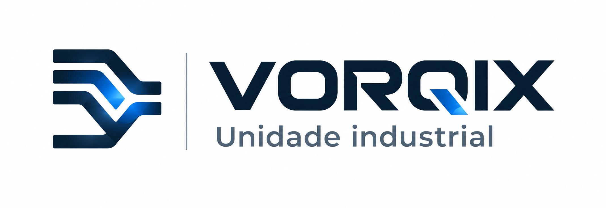

# VORQIX — Unidade Industrial



Sistema CMMS industrial para operação, manutenção, PCM e gestão.

> Este repositório é a base independente do VORQIX, derivada de um sistema
> previamente desenvolvido sob o nome "FAB Control". A partir daqui, o
> desenvolvimento segue de forma desvinculada, com histórico e identidade
> próprios.

## Ambientes

- `main`: versão estável e aprovada.
- `dev`: desenvolvimento e integração.
- `feature/*`: funcionalidades isoladas.
- `fix/*`: correções isoladas.

## Estrutura

```text
frontend/         Aplicação web responsiva do operador
frontend-gestor/  Aplicação web responsiva do gestor, supervisor técnico e administrador
backend/          API, regras de negócio e integração com o banco
docs/             Arquitetura, padrões e contratos
mockups/          Referências visuais aprovadas
scripts/          Scripts de apoio
assets/           Identidade visual (logo, marca)
```

Referências visuais oficiais:

- `mockups/FAB-Control-Mockup operador.html`
- `mockups/FAB-Control-Mockup gestor.html`
- `mockups/FAB-Control-Mockup admin.html`

Não versionar tokens, credenciais, URLs privadas ou dados reais de produção.

## Backend Node.js e PostgreSQL

O estado validado da migração, os comandos de teste, os acessos locais dos três
portais e o procedimento de corte/rollback estão em
[`docs/migration/node-postgresql-completion.md`](docs/migration/node-postgresql-completion.md).
